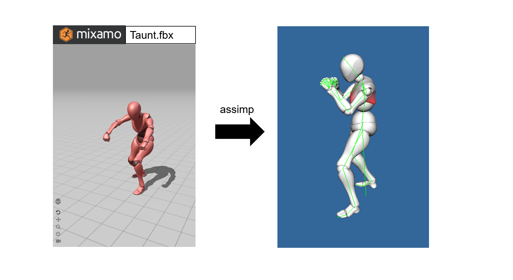
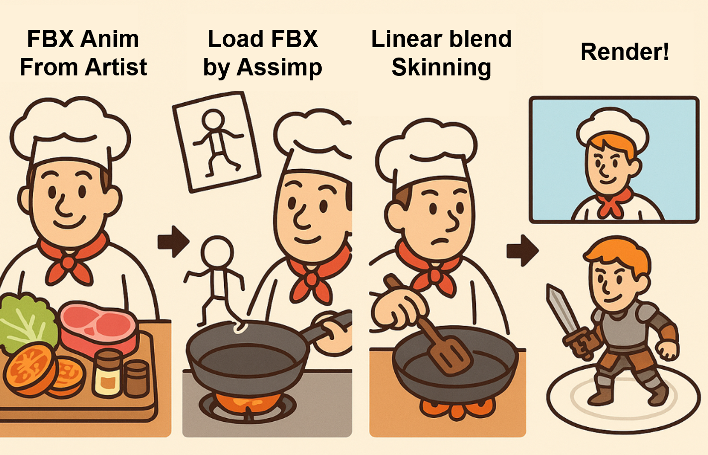
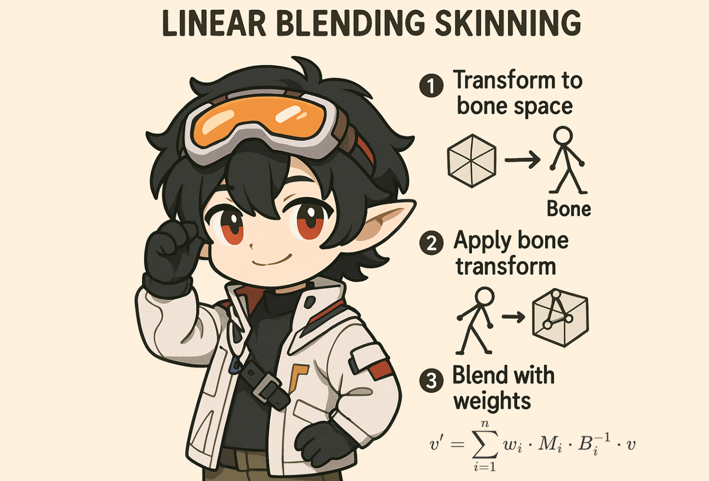

# AnimationLearnerD3D11

A Direct3D11-based animation learner project that demonstrates loading, animating, and skinning a skeletal FBX model using the [Assimp](https://github.com/assimp/assimp) library. Developed with Visual Studio 2022 on Windows 11, this project walks through essential animation pipeline steps such as model importing, bone visualization, skeletal animation, and Linear Blend Skinning (LBS).



This relates to my latest post on [zhihu(chinese)](https://zhuanlan.zhihu.com/p/1912302424607143569).

## 📌 Features



- Load static FBX models via Assimp
- Visualize skeletal hierarchy
- Animate bones without skinning
- Apply Linear Blend Skinning (LBS) on the GPU
- Use classic Phong shading for lighting

## 🛠 Requirements

- Windows 11
- Visual Studio 2022
- DirectX 11 SDK
- Assimp (compiled as DLL)

## 🚀 Getting Started

### Clone the repository

```bash
git clone https://github.com/liubai01/AnimationLearnerD3D11.git
cd AnimationLearnerD3D11
```

## 📚 Implementation Highlights

### ✅ Static Model Import

- Load static FBX model in T-pose using Assimp
- Skip materials, apply basic Phong shading
- See [this commit](https://github.com/liubai01/AnimationLearnerD3D11/commit/fd692236946dda99be815293eb0bced116690114)

### ✅ Bone Hierarchy Visualization

- Load bone structure and draw bones as green lines
- Disable depth testing to ensure visibility
- See [this commit](https://github.com/liubai01/AnimationLearnerD3D11/commit/63ec58661ac09bfd44ba2673f545077aaa510ad1)

### ✅ Skeleton Animation (without skinning)

- Extract animation channels (`aiNodeAnim`) and keyframes
- Perform position, rotation, and scale interpolation per frame
- Traverse bone hierarchy to accumulate global transforms
- See [this commit](https://github.com/liubai01/AnimationLearnerD3D11/commit/01709501d3de971dcc39016c53b6c86fe2928287)


### ✅ Linear Blend Skinning (LBS)




- Implemented on GPU using a constant buffer with up to 128 bone matrices

- On CPU, traverse bone hierarchy to calculate:

  ```
  boneMatrix[i] = globalTransform * inverseBindPose
  ```

- Upload matrices via `UpdateSubresource` to GPU

- See [this commit](https://github.com/liubai01/AnimationLearnerD3D11/commit/40119dd5abc6e0ac37ead3752d1b7509206c93ed)

## 📄 License

This project is open-source under the MIT License.

------

## 🙌 Acknowledgments

- [Assimp](https://github.com/assimp/assimp)
- [Mixamo](https://www.mixamo.com/)
- DirectX11 tutorials and community